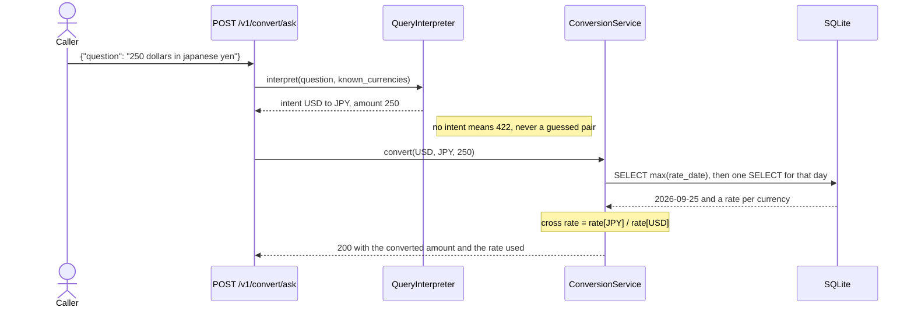

# currency-exchange

The European Central Bank publishes one file a day: the euro reference rates, in
XML, on working days only. This service reads it, keeps every day it has seen,
and answers what the raw file cannot — what a currency did since yesterday,
what 250 dollars is in yen, what the rate was last Tuesday.

Rates are euro-based, so any other pair is a cross rate through EUR, and an
answer always cites the rate and publication date it came from.

```console
$ curl -s 'http://localhost:8000/v1/convert?from=USD&to=JPY&amount=100'
{"source":"USD","target":"JPY","amount":100.0,"converted":15759.0108,
 "rate":157.59010787,"rate_date":"2026-09-25","base":"EUR"}
```

## Getting it running

Python 3.13 or newer (developed on 3.14, the image uses 3.13). No database
server, no API key, and no network required.

```bash
python3 -m venv .venv && source .venv/bin/activate && pip install -r requirements.txt

# static = a built-in snapshot, no network. Drop it for the live ECB file.
RATES_PROVIDER=static python -m app.cli seed
uvicorn app.main:app --reload
```

Open <http://localhost:8000/docs> for the OpenAPI page, or `GET /` for the
endpoint list. Seeding reports what it stored — against the live source, on the
day this was written, `Stored 29 quotes for 2026-09-25 (29 new, 0 updated).`
`python -m app.cli show` prints that snapshot without starting a server.

## What you can ask it

| Endpoint | What it answers |
| --- | --- |
| `GET /healthz` | Is the database reachable, how old is the newest snapshot |
| `GET /v1/rates` | The newest published snapshot, paged and filterable |
| `GET /v1/rates/{currency}` | One currency, with its move since the previous published day |
| `GET /v1/rates/{currency}/history` | The last N publication dates for it |
| `GET /v1/convert` | `from`, `to` and `amount`, at the newest rates |
| `POST /v1/convert/ask` | The same conversion, asked in a sentence |

Listings report `total`, `limit`, `offset` and `has_more`, `limit` is clamped to
`MAX_PAGE_SIZE` so `?limit=10000` still asks for 200 rows at most, and
repeating `?currency=USD&currency=JPY` narrows a page. Failures are named: an
unpublished currency gives `404` with `{"detail":"no rate is published for
currency 'XYZ'"}`, and asking before anything is ingested gives `409` naming the
command to run — each a `ServiceError` mapped to a status code by one table in
`app/main.py`.

## How a question in words becomes a number

`POST /v1/convert/ask` takes a sentence. An interpreter decides *what was
asked*; the arithmetic comes from the stored rates, so the model — when one is
used at all — never produces the figure.

```console
$ curl -s -X POST http://localhost:8000/v1/convert/ask \
    -H 'Content-Type: application/json' \
    -d '{"question":"how much is 250 dollars in japanese yen"}'
{"question":"...","interpreter":"rules","conversion":{"source":"USD",
 "target":"JPY","amount":250.0,"converted":39397.527,"rate":157.59010787,
 "rate_date":"2026-09-25","base":"EUR"}}
```



Two interpreters implement the same `QueryInterpreter` protocol:
- **`rules`** (default, `app/ai/rules.py`) — 85 aliases and 8 currency symbols
  across 31 currencies, plus an amount parser that reads `1,250.50`, `2k` and
  `3m`. Offline and deterministic, so its behaviour is asserted case by case.
- **`anthropic`** (`app/ai/anthropic_interpreter.py`) — sends the question to
  Claude with a strict tool schema and reads the structured arguments back.
  Needs `NLQ_PROVIDER=anthropic`, `ANTHROPIC_API_KEY` and `pip install anthropic`.

The Claude path degrades rather than failing: missing package, missing key,
network error or unusable answer all fall through to the rule parser, and the
response names the interpreter that read the question. It needs a live key, so
**the suite does not exercise it** — what it covers is that the fallback fires
and returns the right conversion. One deliberate ambiguity: bare "dollar" means
USD, bare "peso" means PHP.

## Where the rates come from

`RateProvider` is a protocol over "a dated set of euro rates", with two
implementations registered in `app/providers/__init__.py`: `ecb` reads the live
`eurofxref-daily` document over HTTPS with a timeout, turning network or parse
trouble into `RateProviderError`, and `static` returns a fixed 30-currency
snapshot so service, tests and Compose all run offline. Ingest is worth three
sentences:

- **It stores the ECB's own publication date.** The ECB skips weekends and
  target holidays, so "the latest rates" is the newest `rate_date` in the table,
  never "today" — the newest snapshot was three days old as this was written.
- **It computes every day-over-day move in one query.** The previous snapshot is
  read with a single `SELECT` keyed on `rate_date`, not one lookup per currency,
  and the whole day is written in one transaction.
- **It is idempotent.** `(currency, rate_date)` is unique and a repeat run
  updates in place, so re-seeding or retrying cannot duplicate a day.

A cron job runs that same path just after midnight (`INGEST_HOUR`,
`INGEST_MINUTE`), logging failures instead of raising: a bad fetch should not
take the API down with it.

## Settings

Read from the environment in `app/config.py` and nowhere else — copy
`.env.example` if you want a file. Every value defaults to something that works.

| Variable | Default | Notes |
| --- | --- | --- |
| `DATABASE_URL` | `sqlite:///./exchange_rate.db` | Any SQLAlchemy URL |
| `RATES_PROVIDER` | `ecb` | `ecb` or `static` |
| `HTTP_TIMEOUT_SECONDS` | `10.0` | Upstream fetch timeout |
| `SCHEDULER_ENABLED` | `true` | Off for tests and one-shot runs |
| `INGEST_HOUR` / `INGEST_MINUTE` | `0` / `2` | When the daily fetch runs |
| `DEFAULT_PAGE_SIZE` / `MAX_PAGE_SIZE` | `50` / `200` | The cap is server-side |
| `NLQ_PROVIDER` | `rules` | `rules` or `anthropic` |
| `ANTHROPIC_MODEL` / `ANTHROPIC_API_KEY` | `claude-opus-5` / unset | Read only when `NLQ_PROVIDER=anthropic`, never committed |
| `ECB_URL` | the ECB daily file | Point it at a mirror or a fixture server |

## Layers

```
app/
  config.py        the only module that reads os.environ
  db.py            engine, session factory, declarative base
  models/          one table: exchange_rate
  repositories/    every SQL statement in the project
  services/        ingest, rate queries, conversion, error types
  providers/       where rates come from   (ecb | static)
  ai/              how a sentence becomes a conversion   (rules | anthropic)
  api/             routes and dependencies
  scheduler.py     the daily ingest job
  cli.py           python -m app.cli seed | show
```

Dependency runs one way: routes call services, services call repositories, and
repositories are the only code that touches SQLAlchemy. A route receives a
service through `Depends`, never a `Session`, which is what makes the whole API
testable against a throwaway database.

## Checks

```bash
pip install -r requirements-dev.txt
pytest          # 135 passed
ruff check .
ruff format --check .
```

The suite runs against a temporary SQLite file and the `static` provider, so it
needs no network and no fixtures on disk. It covers the ECB XML parser and its
malformed cases, ingest idempotency, pagination bounds, cross-rate arithmetic
both ways through EUR, every natural-language case above, and each error's
status code.

## Containers

```bash
docker compose up --build
curl -s http://localhost:8000/healthz
```

Two services from one image: a one-shot `seed` container that fills a named
volume, and `api`, which starts only once seeding has succeeded. The image is
multi-stage, installs into a virtualenv copied into a `python:3.13-slim`
runtime, runs as uid 10001, and polls `/healthz`. Set `RATES_PROVIDER=ecb` to
seed from the live source. **Not verified:** the image has not been built or
booted here — Docker was unavailable on this machine, and `docker compose
config` parses is all that was checked.

## Things it deliberately does not do

- **No authentication, and no intraday quotes.** The rates are public, and the
  ECB publishes once per working day — anything labelled "live" would be a lie
  about the source.
- **No currency-aware rounding.** Amounts round to 4 decimal places uniformly.
  JPY has no minor unit and BHD has three, so billing would need a real table.
- **No Redis, and no Postgres service in Compose.** One indexed table holding
  ~30 rows per working day needs neither, and `DATABASE_URL` takes a PG URL.
